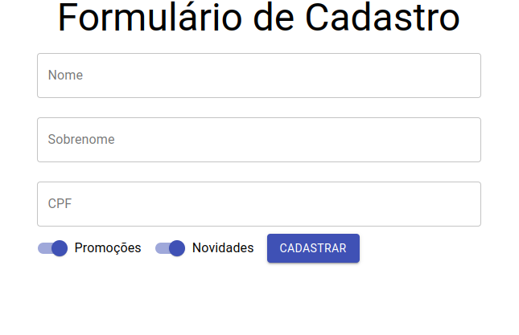

Este projeto foi feito com base no curso da Alura "React: Function Components, uma abordagem moderna", onde é utilizado a biblioteca Material-Ui.

Foi criado um Formulário de cadastro para inserção de Nome, Sobrenome e Cpf com mensagem de erro sobre o limite de caractes. Há checkbox personalizados, para receber promoções e novidades, tambem foi criado o botão de cadastrar para efetuar o suBmit do Formulário.

